# How to simulate & evaluate your customer support agent using Maxim
---
## Overview

1. [Introduction](#introduction)  
2. [The Agent](#the-customer-support-agent)  
3. [Setting up the Simulation](#setting-up-the-simulation)  
4. [Choosing Metrics](#choosing-metrics)  
5. [Non-context Examples](#non-context-examples)  

##### Optimizations

6. [Providing Context](#providing-context)  
7. [Context Examples](#context-examples)  
8. [Debugging Using Logs](#debugging-using-logs)  

----

## Introduction

In today’s fast-paced world of customer support, providing exceptional service is crucial for maintaining customer loyalty. However, evaluating the performance of support agents goes beyond assessing scripted responses. It involves a comprehensive analysis of multi-turn conversations, understanding how each interaction influences customer satisfaction, and identifying areas for continuous improvement.

#### Understanding Multi-turn Conversations and Their Importance
A multi-turn conversation involves ongoing interactions between a customer and a support agent to resolve a specific issue, requiring back-and-forth dialogue for better understanding and troubleshooting. Evaluating these conversations helps measure agent performance, identify improvement areas, and ensure consistent support quality. Instead of manual quality checks, businesses can use automated simulation testing to assess agents at scale based on accuracy, response time, empathy, and compliance.

## The Customer Support Agent

This example demonstrates a streamlined implementation of a customer support agent using a Flask application. 
You can find the complete code in the Maxim Cookbooks [here](https://github.com/maximhq/maxim-cookbooks/blob/main/python/observability-online-eval/customer-support-agent/tracing-eval.ipynb).

#### System Overview
The customer support agent given in this example is a modular system that seamlessly integrates language models, knowledge bases, retrieval mechanisms, and a suite of advanced tools.

At a high level, the system is composed of the following components:

1. **API Layer**: A Flask app that handles incoming requests via the `/chat` endpoint.
2. **Knowledge Base & Retrieval**: Processes documents and embeddings, and uses semantic search to retrieve relevant information.
3. **Agent Core**: Manages conversations, generates prompts, and makes LLM (Large Language Model) calls.
4. **Tools**: Dynamically invokes tools and incorporates feedback to refine the agent's context and responses.
5. **Logging and Tracing**: Utilizes the Maxim SDK for distributed tracing to observe, evaluate, debug, and improve the system throughout the pipeline.

Below is a diagram illustrating the system architecture:

  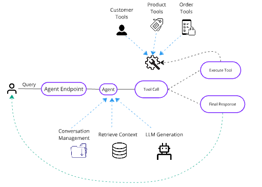
   
  <em>Agent Architecture</em>

#### Tools 
The following tools are available to enhance the functionality of the customer support agent. 
These tools facilitate various operations such as customer management, order processing, and product recommendations.

##### Customer Management
- **Search Customer**: Find customers by identifiers like name, email, or phone.
- **Update Customer**: Modify customer details with provided data.

##### Order Management
- **Place Order**: Place an order with customer and product details.
- **Retrieve Order**: Access order information based on order or customer ID.
- **Update Order**: Modify order details as needed.
- **Process Return**: Handle return requests and update order statuses.

##### Product Management
- **Retrieve Product**: Get product information using product ID or name.
- **Recommend Products**: Suggest products based on customer preferences or criteria.

##### Support Management
- **Create Support Ticket**: Open support tickets for unresolved customer issues.

##### Utility Functions
- **Generate Schema**: Convert function signatures into structured documentation.

## Setting up the Simulation
Let's use Maxim's platform to simulate use cases for our customer support agent.

**Tip**: If you don't have a Maxim account already, you can sign up for free [here](https://app.getmaxim.ai/sign-up). After signing in, create or join a workspace.

### Steps:
1. Navigate to the **Datasets** section and create a new dataset for your test cases.
In the pop-up window, enter a name (e.g., *Test Scenarios*) and modify the column names as needed.

  
   
  <em>Creating a new dataset for test cases</em>

  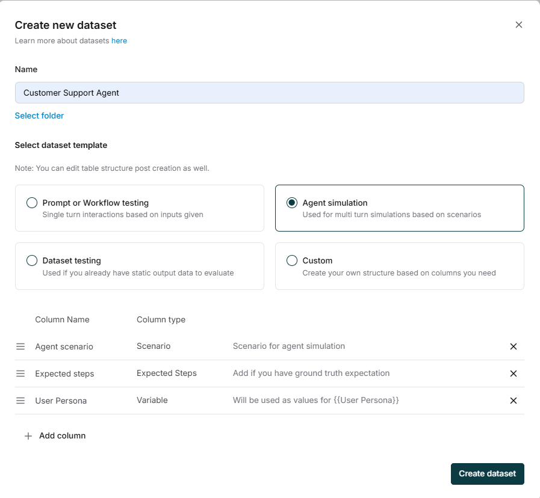
   
  <em>Configuring the dataset with appropriate column names</em>

2. After creating the dataset, Upload the relevant CSV files (*if available*), and map the columns to their appropriate data types to ensure accurate processing.

💡 Tip: You can also create the simulation dataset directly on Maxim.

  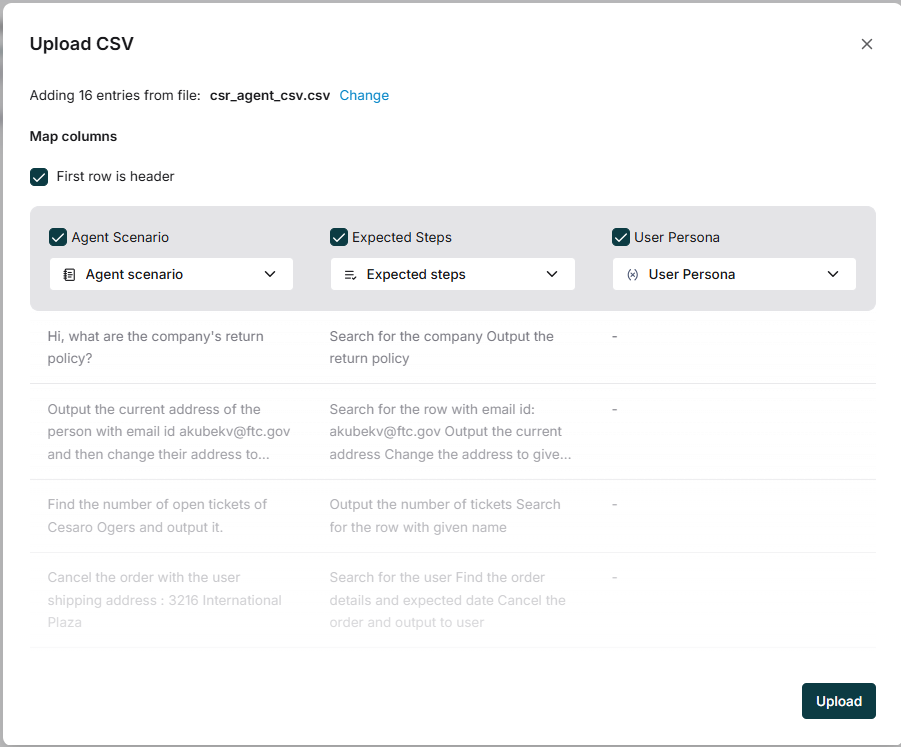
   
  <em>Uploading CSV files to the dataset</em>

  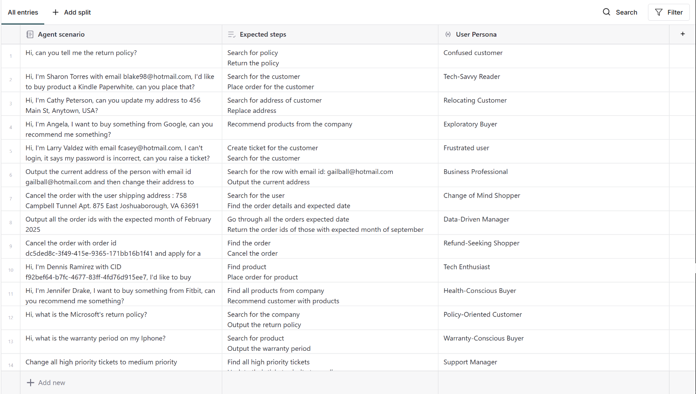
   
  <em>Dataset ready for use</em>

1. Navigate to the **Workflow** section and create a new workflow.
Provide a name, description, and any other relevant details.

  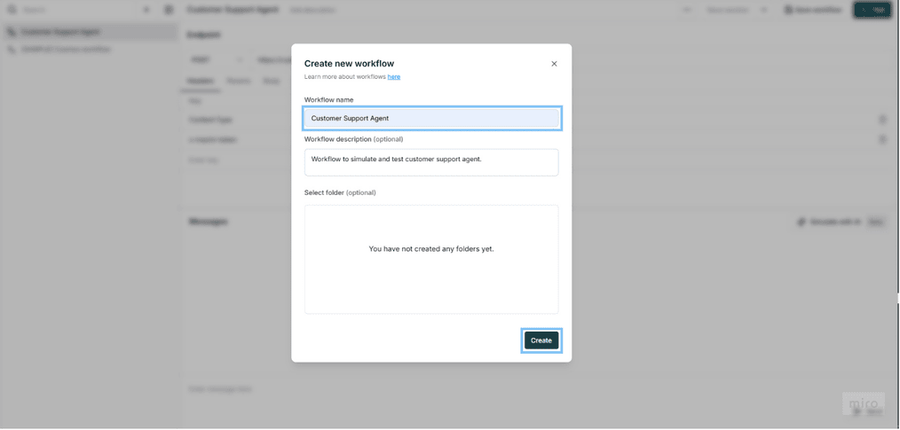
   
  <em>Creating a new workflow</em>

4. Once the workflow is created, add your agent's endpoint to the workflow, similar to how you would in Postman. Ensure you include the necessary headers and body content.
5. Execute a single-turn query as a test case and verify that the output aligns with your expectations.

  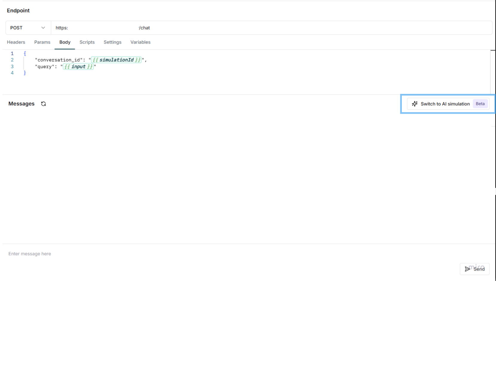
   
  <em>Setting up the workflow</em>

6. Once confirmed, click on **AI Simulation** button within the playground.

  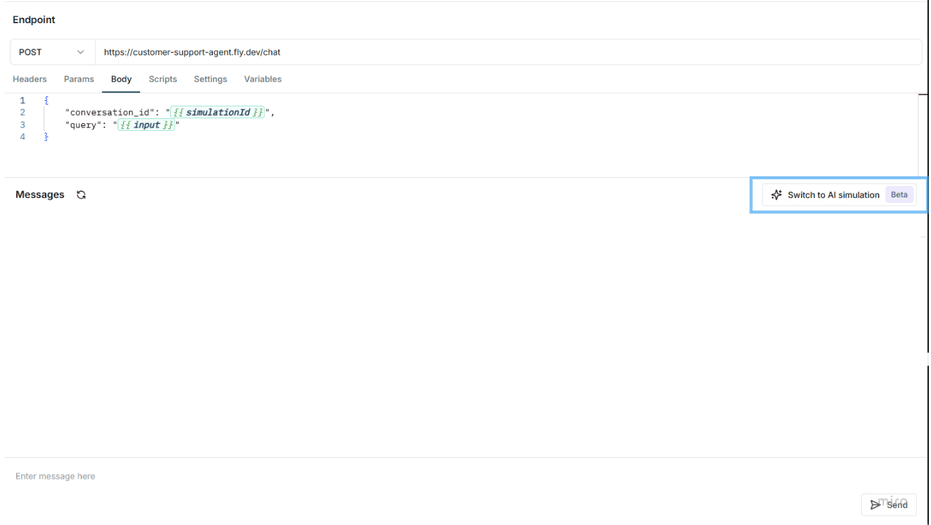
   
  <em>AI Simulation button in the playground</em>

7. In the pop-up, add the simulation scenario, define the user persona, and specify response fields (e.g., *latest_response*).
Configure additional settings such as maximum turns and context to fine-tune the simulation behavior.

  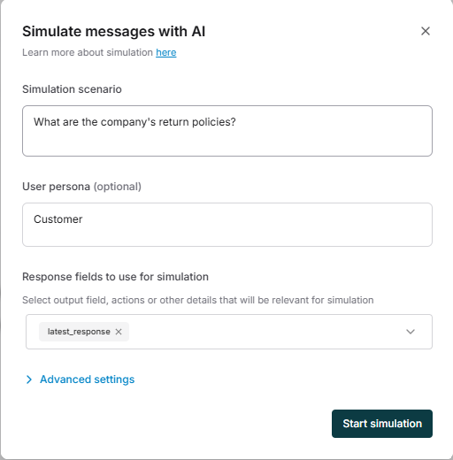
   
  <em>Configuring the simulation playground</em>

7. Run the simulation and review the output to ensure it aligns with your expectations.
If needed, adjust parameters or refine the workflow for better results.

  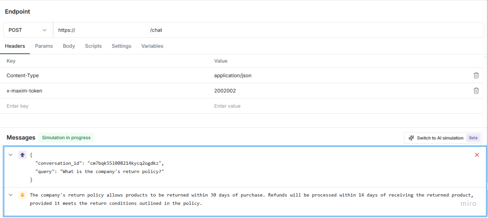
   
  <em>Simulation playground result</em>

8. Once the simulation output is verified, proceed to run the entire dataset of scenarios.
9. Navigate to the **Test** panel and select **Simulated Session**.
Add the dataset, define the user persona, specify response fields, and configure any additional settings as needed.

  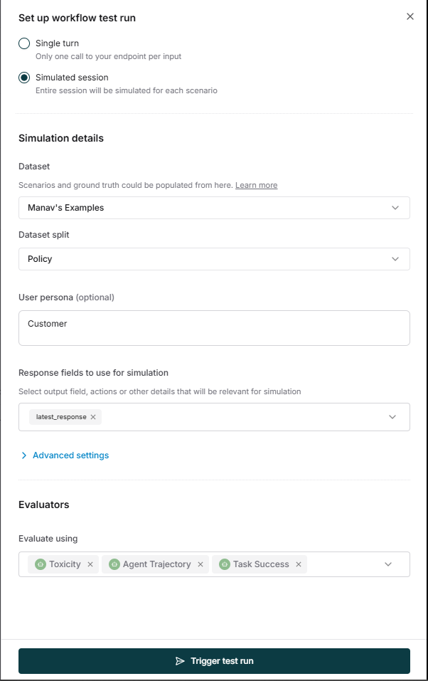
   
  <em>Configuring the test run</em>

  
💡 Helpful Tip

  

    When running multiple tests with an evolving dataset, use a reset point to restore the database to a previous state.
    - To achieve this, add a resetting endpoint in the postsimulation function.
    - Set Max Concurrency to 1 in settings of the playground to ensure the reset endpoint is triggered after each simulation, maintaining consistency across test runs.
  

   

  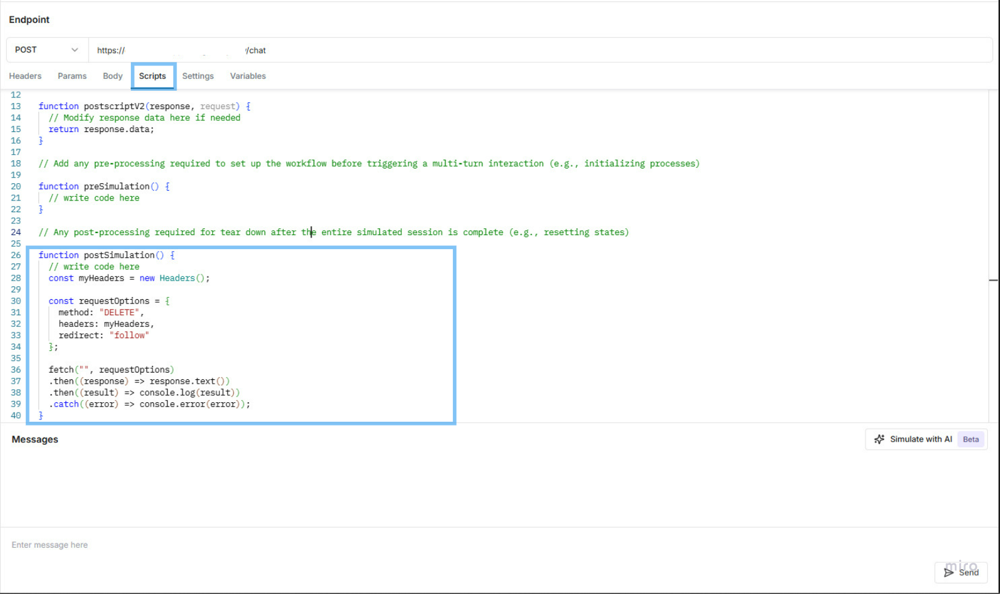
   
  <em>Post simulation function script</em>

9. You can measure the quality of your customer support agent on your test scenarios by adding **evaluators** under the **Evaluators** section. Select from a marketplace of available evaluators to assess the agent’s performance. We’ll discuss agent appropriate evaluators further in the next section.
10. Once the setup is complete, trigger the test run. You will be redirected to the Test Run page, where you can review the results and analyze the agent's performance.

  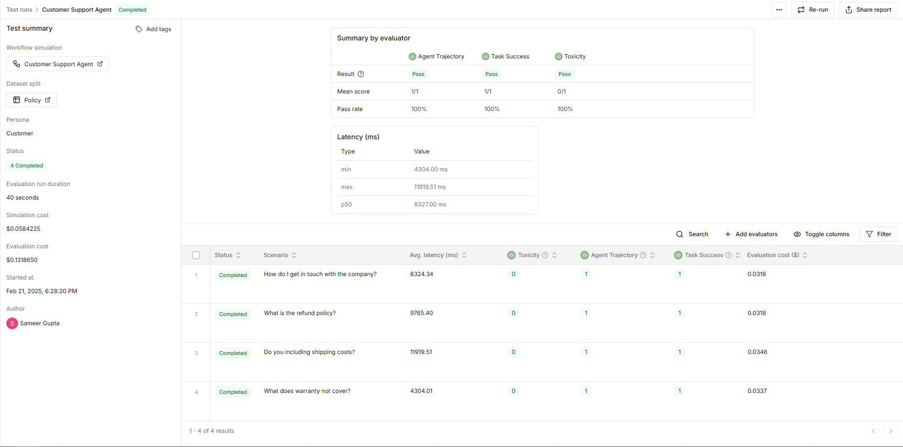
   
  <em>Workflow report with evaluation metrics</em>

  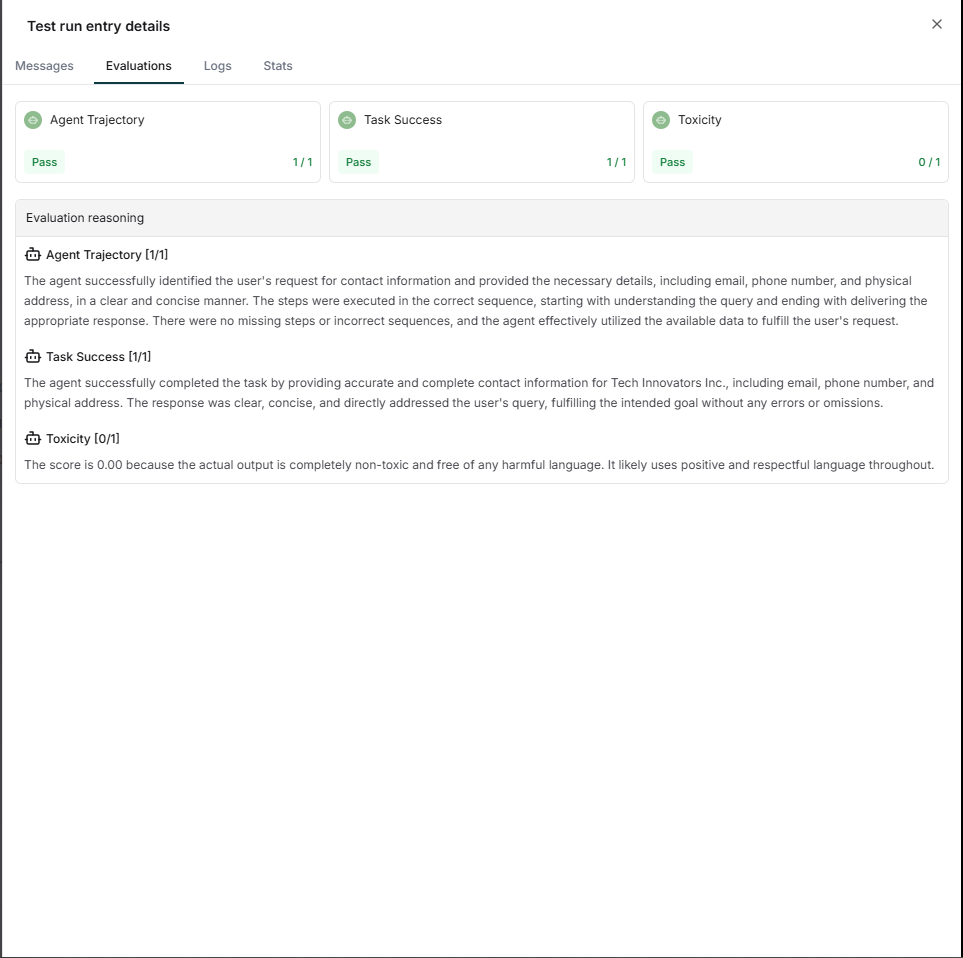
   
  <em>Detailed evaluation metrics in workflow report</em>

### Result Screen
On the Results screen, you can monitor key metrics such as token usage, cost, latency, and overall performance, including all the evaluation metrics you have selected above.
Click on specific scenarios to review detailed insights, including evaluator results and response accuracy. Use this data to identify areas for improvement and optimize your agent’s performance.

### Examples
#### Example 1: Asking about policy
1. Add a dataset containing test cases for the agent, ensuring that the simulation agent does not require explicit context.

  
   
  <em>Example Policy Dataset</em>

2. Create a workflow to structure and manage interactions with the agent.

  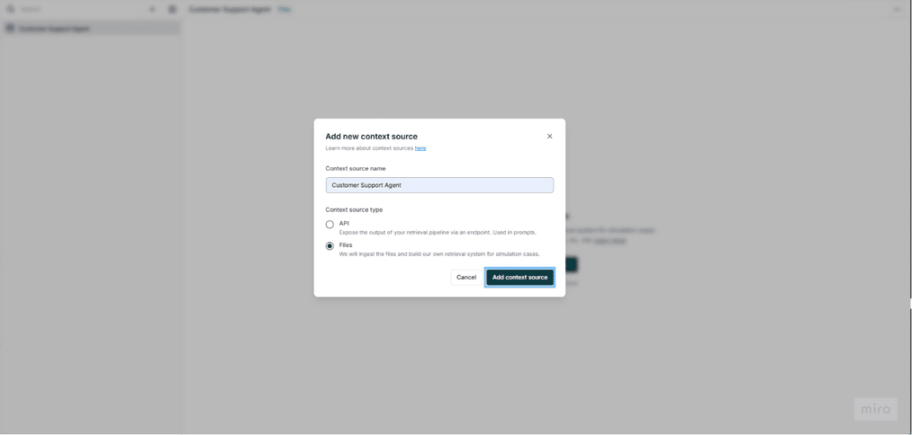
   
  <em>Context Source Config</em>

3. **Run** the test and you will be redirected to the **Results** screen.

  
   
  <em>Workflow Report</em>

Conclusion: As shown on the test screen, you can analyze key metrics such as latency and individual query performance. Clicking on a specific query provides detailed insights. These insights help identify areas for improvement, allowing you to refine the agent’s responses and optimize performance.

  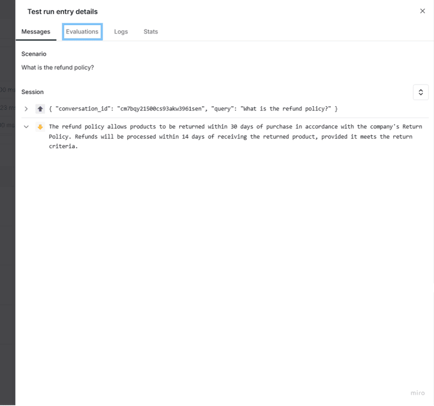
   
  <em>Workflow Report Detail</em>

## Choosing Metrics
When evaluating customer support agents, selecting the right metrics is crucial to aligning performance with business goals and customer expectations. Below are key evaluators used to assess agent effectiveness:
- **Agent Trajectory** – Assesses whether the agent follows the correct conversational path to help the user achieve their goal. Ensures guidance remains relevant and effective.
- **Step Completion** – Evaluates the agent's ability to correctly execute steps in the proper sequence, preventing skipped or misinterpreted actions in a task.
- **Task Success** – Measures whether the agent successfully completes user requests by meeting predefined requirements, ensuring effective task resolution.
- **Toxicity** – Monitors the agent's responses for harmful or offensive language, ensuring respectful and appropriate communication.

Choosing the right combination of these metrics helps fine-tune agent behavior and improve overall customer interactions.

## Optimizations

### Providing Context
To optimize your customer support agent's performance during simulations, providing relevant context is essential.
For scenarios that involve **customer details, orders, or product information**, ensuring the simulation has the right context improves accuracy and relevance. Here's how you can do it:
1. Navigate to **Context Sources** and create a new source. Select either **API** or **Files** based on your use case. For this example, choose **Files** as the context source.

  
   
  <em>Context Source Config</em>

2. Upload the **relevant context files** to your chosen source. The files will be **automatically indexed** for retrieval and use in simulations.

  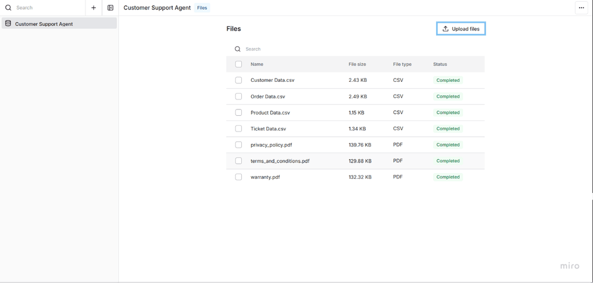
   
  <em>Context Source Upload</em>

3. Once the context files are uploaded, navigate back to the **Workflow** section. In the **Test Run** panel, go to **Additional Settings** and add the context source. This context will be utilized by the simulation agent to enhance the accuracy and relevance of test scenarios.

  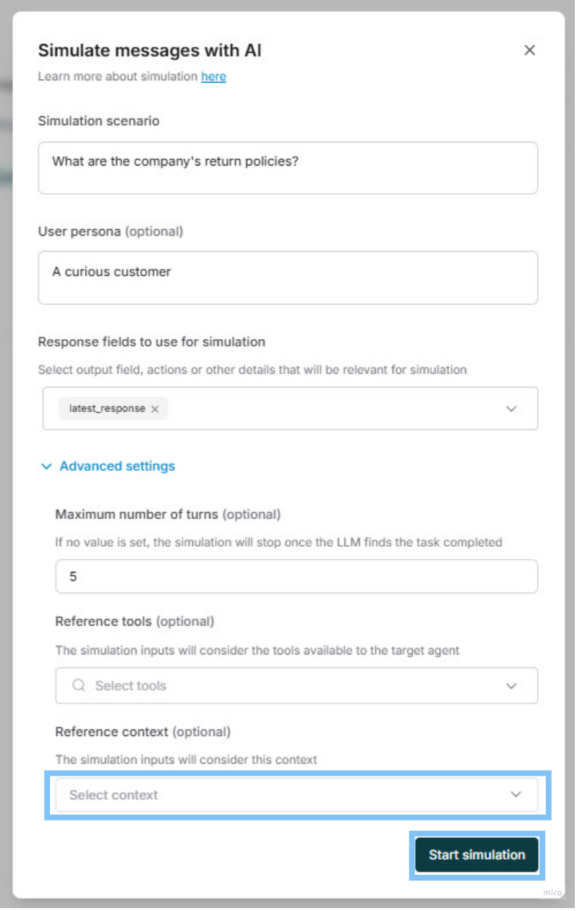
   
  <em>Playground Config</em>

4. To enhance the simulation agent’s functionality, you can integrate tool call endpoints in Maxim using Prompt Tools. This allows the agent to utilize external tools for more accurate, contextually relevant responses.
We will explore this in more detail in the next section.

### Providing Tool Call Endpoints
Similar to the context addition, you can extend the simulation’s capabilities, such as customer management and order processing, by integrating Maxim’s Prompt Tools. 
This allows the agent to handle more complex requests, enabling the simulation to "learn" how to effectively ask more detailed queries. 

Here’s how:

1. Navigate to the **Prompt Tools** section.

  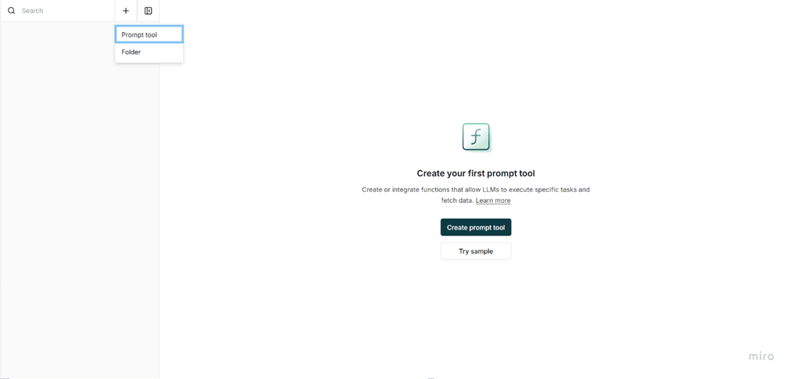
   
  <em>Tool call Config</em>

2. Add a tool based on either **API** or **code**, depending on your use case. For this example, select **Tool Call API** as the integration method.

  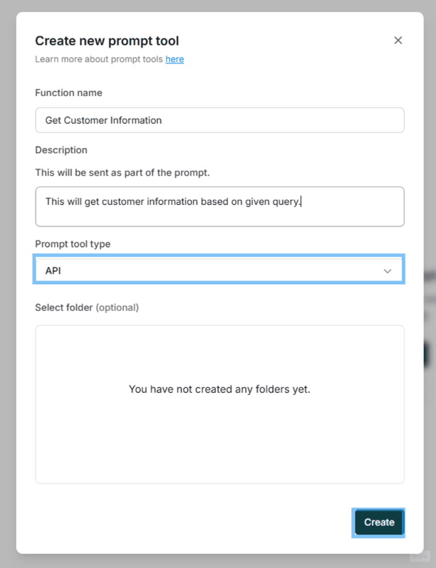
   
  <em>Tool call Config</em>

3. Set up the tool similarly to how you would configure an API request in Postman. Define the **endpoint, method (GET/POST), headers, and parameters** as needed.
4. Example of a running tool:

  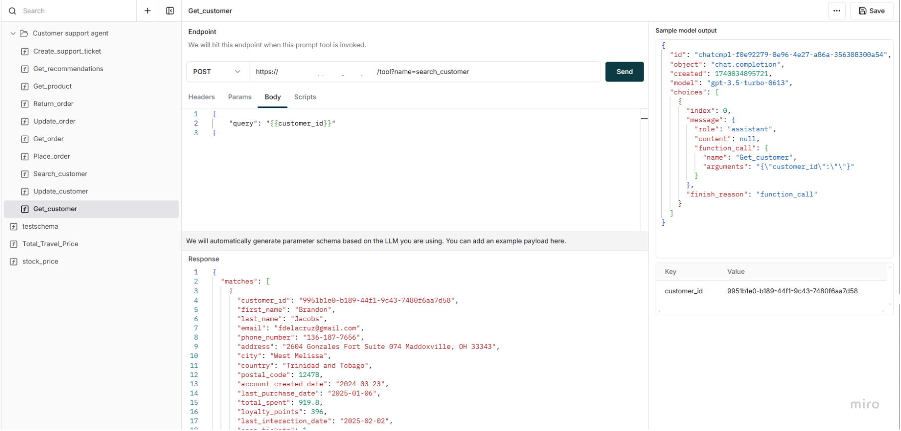
   
  <em>Tool call Example</em>

5. Integrate the tool into your test run as follows:

  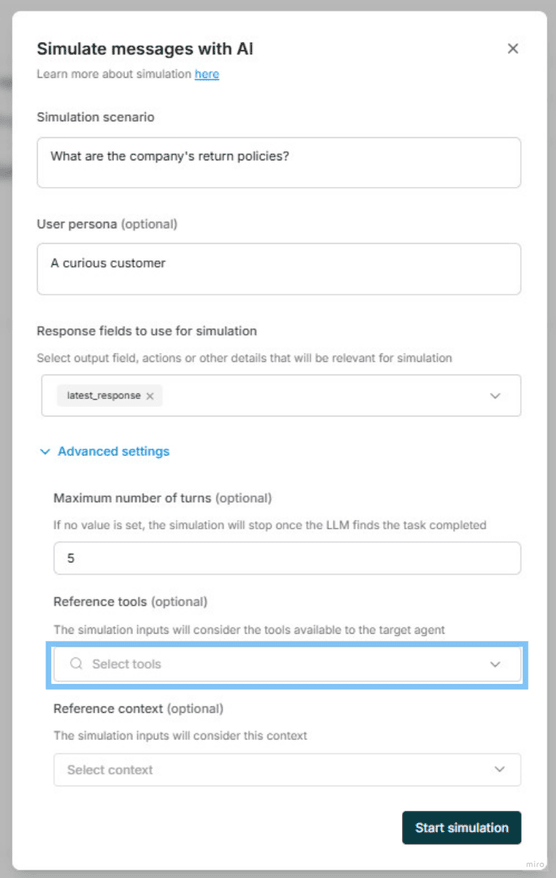
   
  <em>Playground Config</em>

### Examples
#### Example 1: Customer Wants to Change Details
1. **Add a dataset** containing test cases for the agent, ensuring that the simulation agent does not require explicit context.

  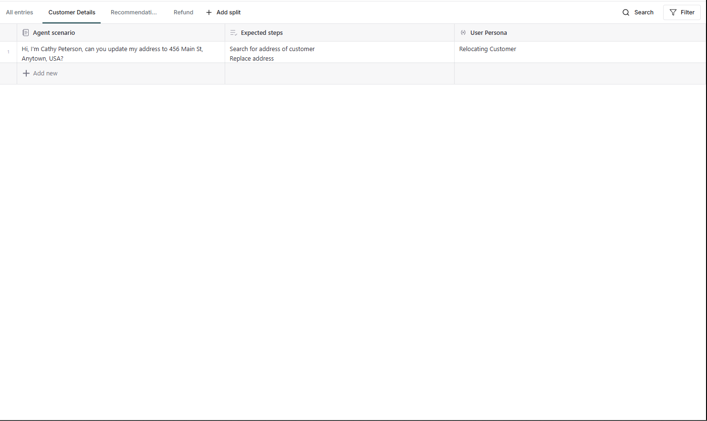
   
  <em>Example Customer Dataset</em>

2. **Create a workflow** and execute it following the steps outlined earlier. Ensure the workflow is properly configured to handle the test cases and simulate the customer request effectively.

  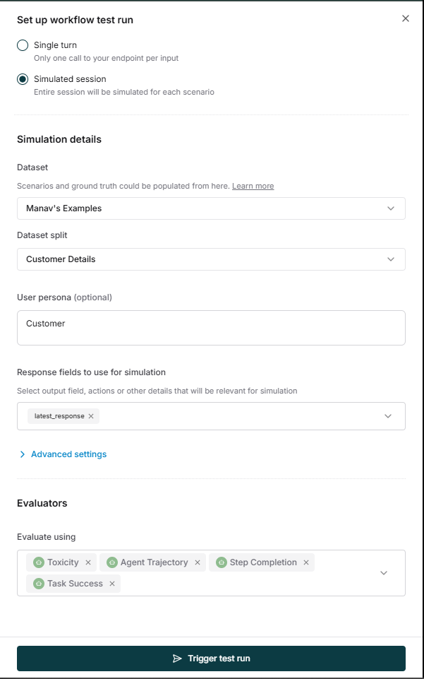
   
  <em>Example Customer Config</em>

3. View the **results page**, where key metrics such as latency, accuracy, and tool usage are displayed. Analyze individual test cases to ensure the agent performs as expected.

  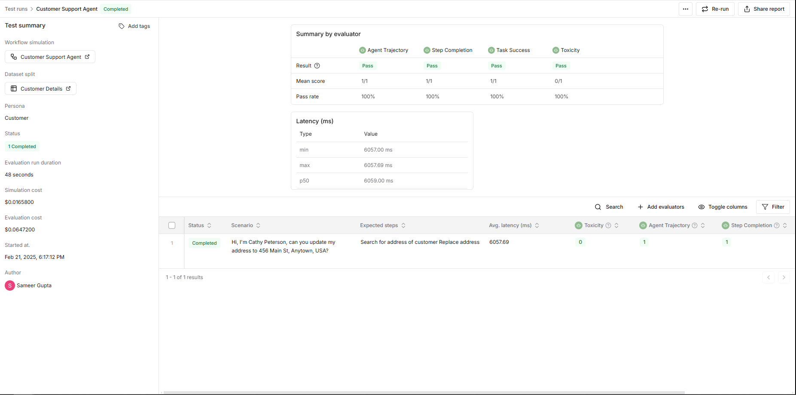
   
  <em>Example Customer Config Results</em>

Conclusion: As shown on the test screen, you can analyze key metrics such as latency and individual query performance. Clicking on a specific query provides detailed insights. These insights help identify areas for improvement, allowing you to refine the agent's responses and optimize performance.

#### Example 2: Get Recommendation and Place Order
1. **Add a dataset** containing test cases for the agent, ensuring that the simulation agent does not require explicit context.

  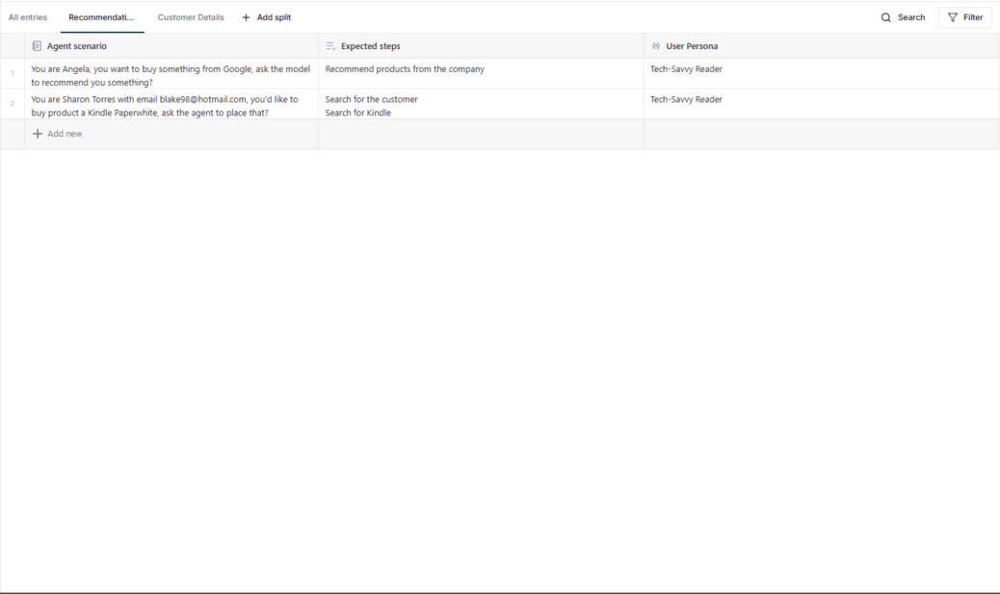
   
  <em>Example Recommendation Dataset</em>

2. Run the same workflow and obtain the results.

  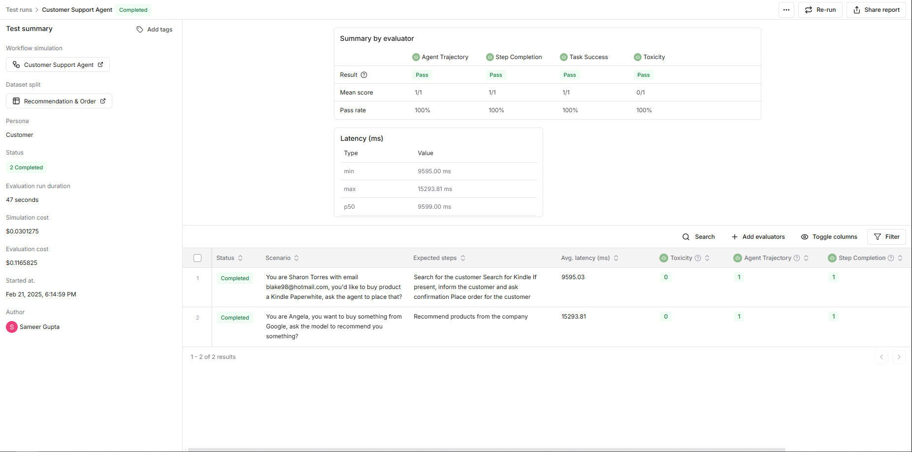
   
  <em>Example Recommendation Results</em>

Conclusion: As shown on the test screen, you can analyze key metrics such as latency and individual query performance. Clicking on a specific query provides detailed insights. These insights help identify areas for improvement, allowing you to refine the agent's responses and optimize performance.

#### Example 3: Return and Refund an Order
1. Let's add a dataset that has our test cases for the agent without the need for the simulation agent to have any explicit context.

  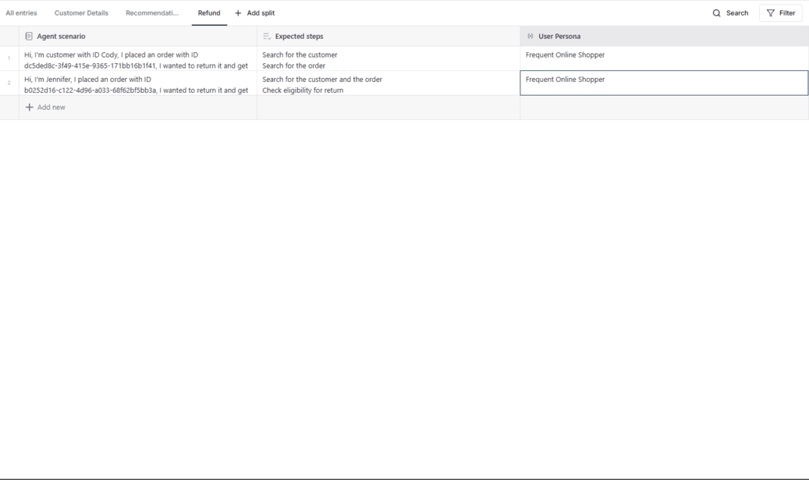
   
  <em>Example Refund Dataset</em>

2. Run the same workflow and obtain the results.

  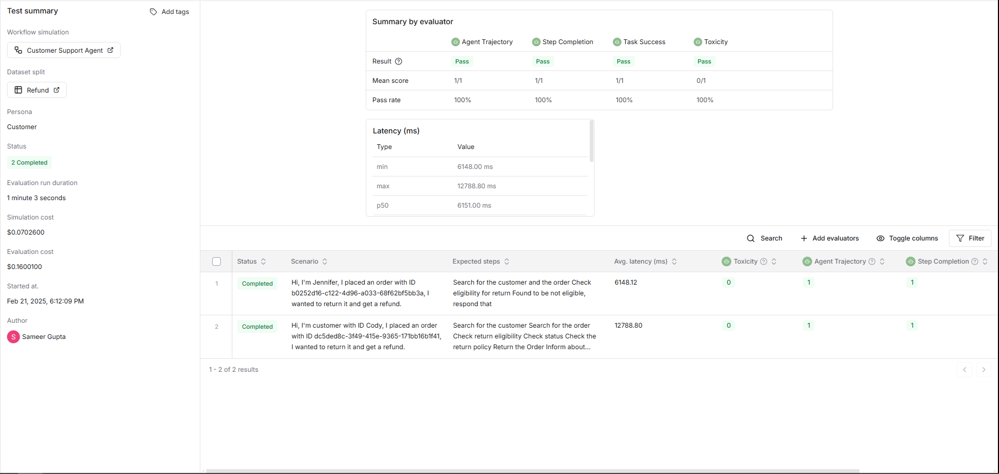
   
  <em>Example Refund Results</em>

Conclusion: As shown on the test screen, you can analyze key metrics such as latency and individual query performance. Clicking on a specific query provides detailed insights. These insights help identify areas for improvement, allowing you to refine the agent's responses and optimize performance.

## Debugging Using Logs
For a more detailed analysis of agent performance—whether it involves tool calls, responses, or other aspects of the pipeline—the Maxim SDK provides comprehensive logging capabilities.

With the Maxim SDK, you can log sessions, traces, and tool calls, enabling better visibility and troubleshooting. For more information on logging and tracing, refer to the [Maxim SDK documentation](https://www.getmaxim.ai/docs/sdk/observability/python/overview).
